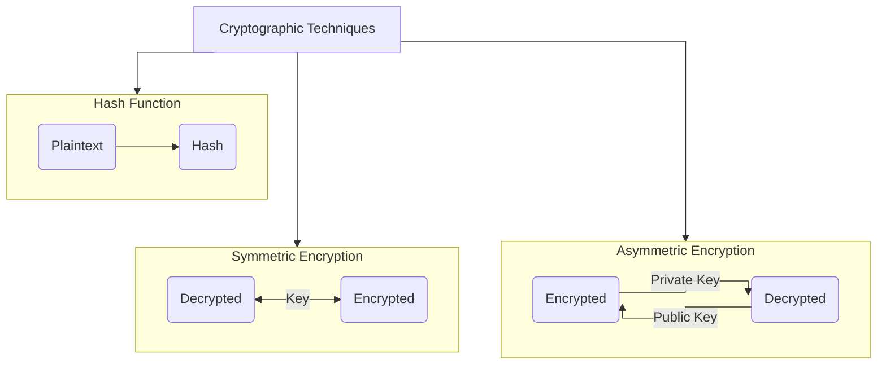
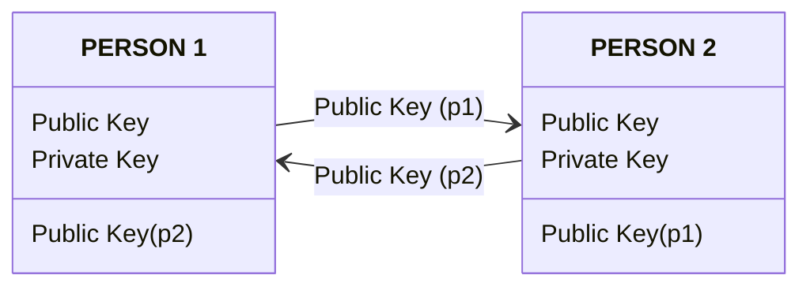

> [!warning]
> I am still learning about this topic, so I will be updating this post (it might contain some errors, so make sure to check the references).

Cryptography uses mathematical techniques to transform data and prevent it from being read or tampered with by unauthorized parties. That enables exchanging secure messages even in the presence of adversaries[^crypto-nist].

There are two kinds of cryptography: symmetric and asymmetric key cryptography. The main difference between them is that symmetric key cryptography uses the same key for encrypt and decrypt the plaintext, while asymmetric cryptography uses a public key for encryption and a private key for decryption.

The following diagram illustrates better the cryptographic techniques used in cybersecurity:



## Hashing
A cryptographic hash algorithm is a technique used to map a message of arbitrary length to a fixed-length message digest[^hash-nist]. A good hashing algorithm will produce unique outputs for each input given (*Collision resistance*), and the only way to crack a hash is by trying every input possible, until you get the exact same hash. 

Some common use cases for hashing functions include password verification, verification of the integrity of a message, or detecting changes in data.

### Hashing Algorithms
Some of the most famous hashing algorithms are MD5, SHA-1, SHA-2 (including SHA-224, SHA-256, SHA-384, and SHA-512), SHA-3, and bcrypt.

#### **MD5**
The MD5 message-digest algorithm (1991) is a widely used hash function producing a 128-bit hash value[^md5-wiki]. On linux you can create a hash of a single string or any file:
```bash
╰─❯ echo -n "hello" | md5sum | cut -d" " -f1
5d41402abc4b2a76b9719d911017c592
╰─❯ cat /usr/bin/firefox-esr | md5sum | cut -d" " -f1
7f97aefd385732bf58e9d1575f621264
```

Alternatively you can do the same with python using [`hashlib`](https://docs.python.org/3/library/hashlib.html#)
```python
import hashlib
myString = "hello".encode()
print( hashlib.md5(myString).hexdigest() )
```
For more details you can check the source code for how to implement the MD5 hashing algorithm in Python at [Utkarsh87/md5-hashing](https://github.com/Utkarsh87/md5-hashing), following the explanations from the [original paper](https://tools.ietf.org/html/rfc1321).


#### Secure Hash Algorithms (**SHA**)
SHA algorithms offer greater security and collision resistance than MD5. SHA-256 is currently one of the most used and recommended hashing algorithms.

```bash
╰─❯ echo 'hello' | sha [tab]
sha1sum    sha224sum  sha256sum  sha384sum  sha512sum
```

---
There are many more hashing algorithms, an extensive list can be found in hashcat's wiki[^hash-examples-hashcat].
To identify the type of hash you can use [hashID](https://github.com/psypanda/hashID), which is a tool written in python created for that purpose.


## Symmetric Key Cryptography
### Symmetric Cryptography[^coursera-googleIT-crypto]
A simple example of a symmetric key encryption algorithm would be a substitution cipher, which is an encryption mechanism that replaces parts of your plain text with ciphertexts. In this case, the key would be the mapping of characters between plaintext and ciphertext. Without knowing what letters get replaced with, you wouldn't be able to easily decode the ciphertext and recover the plaintext. If you have the key or the substitution table, then you can easily reverse the process and decrypt the coded message by just performing the reverse operation. 
A well-known example of a substitution cipher is the Caesar cipher, which is a substitution alphabet. In this case, you're replacing characters in the alphabet with others, usually by shifting or rotating the alphabet, a set of numbers or characters. The number of the offset is the key. 
ROT13 is a Caesar cipher that uses a key of 13. Using ROT13 "HELLO WORLD" <=> "URYYB JBEYQ".

There are two more categories that symmetric key ciphers can be placed into, depending on how the ciphers operate on the plain text to be encrypted:
- Stream ciphers: takes a stream of input and encrypts the stream one character or one digit at a time, outputting one encrypted character or digit at a time. There's a one-to-one relationship between data in an encrypted data out.
- Block ciphers: takes data in, places it into a bucket or block of data that's a fixed size, then encodes that entire block as one unit. If the data to be encrypted isn't big enough to fill the block, the extra space will be padded to ensure the plain text fits into the blocks evenly. 

Generally speaking, stream ciphers are faster and less complex to implement, but they can be less secure than block ciphers if the key generation and handling isn't done properly.

If the same key is used to encrypt data two or more times, it's possible to break the cipher, and to recover the plaintext. To avoid key reuse, initialization vector (IV) is used, which is a bit of random data that's integrated into the encryption key, and the resulting combined key is then used to encrypt the data. The idea behind this is, if you have one shared master key, then generate a onetime encryption key. That encryption key is used only once by generating a new key using the master one and the IV. In order for the encrypted message to be decoded, the IV must be sent in plain text along with the encrypted message. 
A good example of this can be seen when inspecting the 802.11 frame of a web encrypted wireless packet. The IV is included in plain text right before the encrypted data payload. 

### Symmetric Encryption Algorithms
Examples: Caesar Cipher, AES, DES, ChaCha20, Twofish, Serpent, RC5, RC6, Camellia, ARIA, and IDEA.

#### AES
The GNU Privacy Guard (GPG) is a complete and free implementation of the OpenPGP standard[^gpg].

#### Data Encryption Standard (DES)

## Asymmetric Key Cryptography
Asymmetric or public key ciphers are those ones where different keys are used to encrypt and decrypt.

The strength of the asymmetric encryption system comes from the computational difficulty of figuring
out the corresponding private key given a public key.

### How Asymmetric Key Cryptography works
To describe encryption and decryption operations using an asymmetric crypto system, imagine a conversation between two persons:
1. Each endpoint generates a private and public key pairs
2. They exchange only the public keys
3. When PERSON1 wants to send an encrypted message to PERSON2,
	1. P1 uses P2's public key to encrypt the message and then send the cipher text. 
	2. P2 can then use his private key to decrypt the message and read it.



Only P2's private key can decrypt messages encrypted using P2's public key. The same is true of P1's key pairs.

### Public Key Signatures
Let's say PERSON1 wants to send a message to PERSON2 and she wants to make sure that P2 knows the message came from her and no one else, and that the message was not modified or tampered with. She could do this by composing the message and combining it with her private key to generate a digital signature. She then sends this message along with the associated digital signature to Daryll. We're assuming Suzanne and Daryll have already exchanged public keys previously in this scenario. Daryll can now verify the message's origin and authenticity by combining the message, the digital signature, and Suzanne's public key. If the message was actually signed using Suzanne's private key and not someone else's and the message wasn't modified at all, then a digital signature should validate. If the message was modified even by one whitespace character, the validation will fail and Daryll shouldn't trust the message. This is an important component of the asymmetric crypto system. Without message verification, anyone could use Daryll's public key and send him an encrypted message claiming to be from Suzanne. The three concepts that an asymmetric crypto system grants us are confidentiality, authenticity, and non-repudiation. Confidentiality is granted through the encryption-decryption mechanism, since our encrypted data is kept confidential and secret from unauthorized third parties. Authenticity is granted by the digital signature mechanism, as the message can be authenticated or verified that it wasn't tampered with. Non-repudiation means that the author of the message isn't able to dispute the origin of the message. In other words, this allows us to ensure that the message came from the person claiming to be the author.

### Public Key Cryptography Algorithms
Examples: ECC, Diffie-Hellman, DSS


## References
[^crypto-nist]: https://www.nist.gov/cryptography
[^hashing]: Hashing: https://www.codecademy.com/resources/blog/what-is-hashing/
[^hash-examples-hashcat]: Hashcat Example hashes: https://hashcat.net/wiki/doku.php?id=example_hashes
[^4]: https://us.norton.com/blog/emerging-threats/cryptography
[^5]: https://www.encryptionconsulting.com/education-center/what-is-cryptography/
[^6]: [AES](https://www.encryptionconsulting.com/what-is-aes/)
[^hash-nist]: https://csrc.nist.gov/projects/hash-functions
[^md5-wiki]: MD5 at Wikipedia: https://en.wikipedia.org/wiki/MD5
[^coursera-googleIT-crypto]: Coursera Course 5 of 5 in the Google IT Support Specialization (module 2): https://www.coursera.org/learn/it-security
[^gpg]: What’s GnuPG?: https://gnupg.org/faq/gnupg-faq.html#whats_gnupg