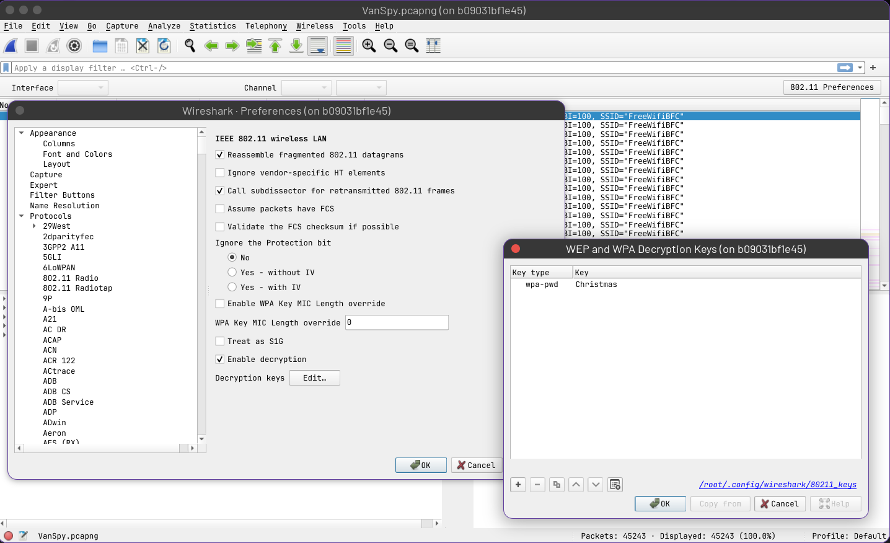

# Advent of Cyber 2023 - Side quest 1

This is the first room that was part of the Advent Of Cyber side quest challenges.
- [SQ1:](aoc23-sq1.md)
- [SQ2:](aoc23-sq2.md)
- [SQ3:](aoc23-sq3.md)
- [SQ4:](aoc23-sq4.md)

## Room discovery
The cool thing about this events was looking for the url of the room, which was hidden on the main event.
As it was the first room, for getting the url we had to find a QR code that was divided in four pieces and hidden on the social media of tryhackme. 

THM room 1: https://tryhackme.com/room/adv3nt0fdbopsjcap

## Package analysis
This wasn't a room but a file to analyze, where we had to answer five questions.

### **Question 1**: *What's the name of the WiFi network in the PCAP?*
This question is easy. Download `VanSpy.pcapng.zip`, extract it and open it with `wireshark`, just by reading you will find it is **FreeWifiBFC**, but you can also apply the filter `wlan.ssid`

### **Question 2**: *What's the password to access the WiFi network?* 
This can be solved using `aircrack` (if the password is weak, which it is), but you will need an extra step:
1. Convert `.pcapng` to `.pcap`: `tshark -F pcap -r VanSpy.pcapng -w VanSpy.pcap`
2. Crack it! `aircrack-ng VanSpy.pcap -w /root/SecLists/rockyou.txt` (password: `Christmas`)

### **Question 3**: *What suspicious tool is used by the attacker to extract a juicy file from the server?*
With the decrypted 802.11 traffic you can search for tcp packets. On wireshark, go to `Edit > Preferences > Protocols > IEEE 802.11`.


If you follow TCP Stream, the last that the attacker did was connecting to a windows machine, and using `mimikatz` to extract a `.pfx` file with the `rsa` key, which you will need to decrypt the TLS traffic.


## **Question 4**: *What is the case number assigned by the CyberPolice to the issues reported by McSkidy?*: `31337-0`
1. Decode the pfx file copied from wireshark: `cat certificate-base64.pfx | base64 -d > certificate.pfx`
2. Extract it with the right password (clue: don't need to bruteforce it, since it was extracted with `mimikatz` that's the default password): `openssl pkcs12 -in certificate.pfx -out keyfile.key -nodes`
  - In case you would like to try bruteforce, in another situation, tou can use `pfx2john` to create a hash.
3. Edit the key and import it to wireshark > preferences > rsa to decrypt the tls traffic. What you are looking for is text that has been copied through RDP clipboard. Wireshark captures that traffic as protocol `CLIPRDR`, if you try to read those packets you will find it.
  - Also some people did use `pyrdp`

## **Question 5**, *What is the content of the yetikey1.txt file?*
`1-1f9548f131522e85ea30e801dfd9b1a4e526003f9e83301faad85e6154ef2834`

---
Additionaly, some mates did use [`pyrdp`]() to convert the rdp session to a mp4 file, which I did after completing the room, but it's a more elegant way of doing it:
1. Load the rsa key to decrypt the tls traffic
2. Export the rdp session 
```bash
apt install libxcb-cursor0
pip install pyrdp-mitm[full]
pyrdp-convert -o . -f mp4 sq1-rdp.pcap
```